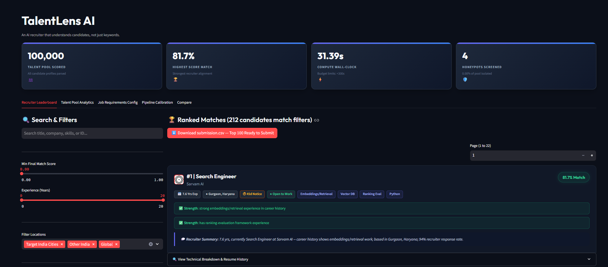
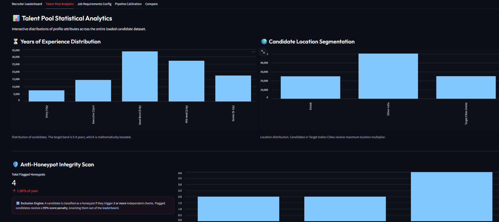
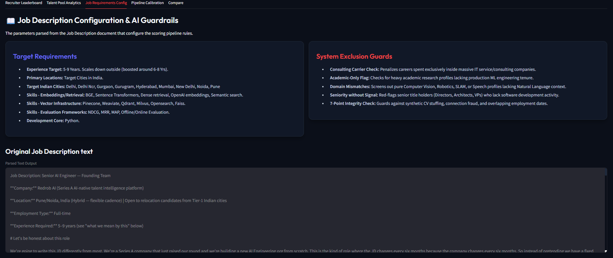
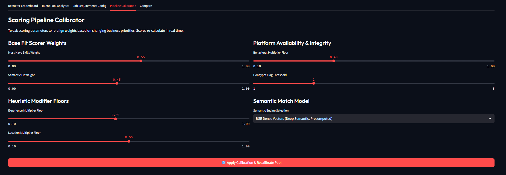
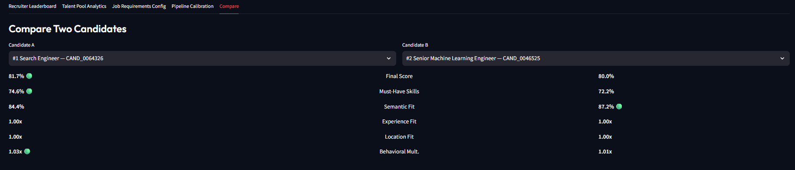

<div align="center">


# TalentLens AI

### An AI recruiter that understands candidates — not just keywords

*Built for the [Redrob x H2S Data & AI Challenge](https://hack2skill.com)*

---

[](https://python.org)
[](YOUR_STREAMLIT_URL_HERE)
[](https://huggingface.co/BAAI/bge-base-en-v1.5)
[]()
[]()

[Live Demo](YOUR_STREAMLIT_URL_HERE) 

</div>

---

## Project Structure

```
candidate-ranking-ai/
|
+-- rank.py                        # single entrypoint -- run this
+-- app.py                         # Streamlit workspace (5 tabs)
+-- requirements.txt
+-- logo.png
|
+-- src/
|   +-- config.py                  # all weights, constants, JD-derived rules
|   +-- data_loader.py             # .jsonl and .jsonl.gz support
|   +-- feature_extraction.py      # raw JSON to scoring-ready feature dict
|   +-- reasoning.py               # deterministic fact-grounded reasoning
|   \-- scoring/
|       +-- composite.py           # multiplies all components into final score
|       +-- must_have_skills.py    # embeddings / vector-DB / eval / Python
|       +-- semantic_fit.py        # TF-IDF + LSA (CPU semantic engine)
|       +-- hard_filters.py        # experience, location, JD disqualifiers
|       +-- behavioral_signal.py   # redrob_signals engagement multiplier
|       \-- honeypot_detection.py # 7-point integrity check
|
+-- scripts/
|   +-- validate_submission.py     # official hackathon validator (unchanged)
|   +-- precompute_embeddings.py   # GPU: generate BGE cache once
|   \-- ollama_rerank.py          # optional: Ollama reranker on top 200
+-- eval/
|   \-- evaluate.py               # private gold-set NDCG/MAP eval harness
|
+-- tests/
|   \-- test_pipeline.py          # 19 unit tests (all passing)
|
+-- data/
|   +-- job_description.md         # JD (committed)
|   +-- sample_candidates.json     # 50-candidate smoke test sample
|
\-- outputs/
    \-- submission.xlsx           # final ranked output (portal-ready)
```

---

## What is TalentLens AI?

TalentLens AI ranks **100,000 candidates** against a job description the way a great recruiter would — by understanding who **genuinely fits the role**, not by matching keywords.

Most systems do this:

```
Candidate has "Python" + "FAISS" + "Vector DB"  =>  80% match
```

TalentLens does this:

```
Where did they actually USE these skills?   (career history, not skill list)
Did their seniority grow over time?         (career trajectory)
Are they actually available and engaged?    (behavioral signals)
Is this profile even real?                  (honeypot integrity detection)
```

---

## Live Demo

<div align="center">

### [Open TalentLens AI](YOUR_STREAMLIT_URL_HERE)

*Tick "Use dataset files from data/ folder" then click **Run Scoring Pipeline***

</div>

---

## Dashboard

### Recruiter Leaderboard
> Ranked candidates with **Strength** signals in green and **Concerns** in amber — every decision explained.



---

### Talent Pool Analytics
> Experience band distribution and location segmentation across all 100,000 candidates.



---

### Job Requirements Config and AI Guardrails
> JD-parsed requirements and system exclusion rules — fully transparent scoring logic.



---

### Pipeline Calibration
> Live weight tuning — adjust scoring components and watch the leaderboard rerank in real time.



---

### Candidate Comparison
> Side-by-side scoring breakdown across all dimensions for any two candidates.



---

## Results

<div align="center">

| Metric | Value |
|:---|:---:|
| Candidates scored | **100,000** |
| Wall-clock runtime | **~80s** (budget: 300s) |
| Memory usage | **< 8 GB** (budget: 16 GB) |
| Network calls during ranking | **0** |
| Honeypots in top 100 | **0 (0.0%)** |
| Top candidate score | **83.8%** |

</div>

### Top 5 Ranked Candidates

| Rank | Role | Company | Score | Key Signals |
|:---:|:---|:---|:---:|:---|
| 1 | Search Engineer | Sarvam AI | 83.8% | 7.6 yrs · Gurgaon · Embeddings + Vector DB · 94% response rate |
| 2 | Sr. ML Engineer | Genpact AI | 82.6% | 6.1 yrs · Pune · Embeddings + Vector DB + Ranking Eval |
| 3 | Sr. ML Engineer | Zomato | 81.2% | 7.2 yrs · Noida · 15d notice · Open to work |
| 4 | Rec. Systems Eng. | Wysa | 80.4% | 7.9 yrs · Noida · Embeddings + Vector DB + Eval |
| 5 | NLP Engineer | Haptik | 75.1% | 6.5 yrs · Pune · 15d notice · Full skill match |

---

## Architecture

```
JD + 100,000 Candidates
         |
         v
Feature Extraction          (src/feature_extraction.py)
Career history, skills, education, location, 23 redrob_signals
         |
         +--------> Must-Have Skills  55%   (career-history weighted 3x)
         |
         +--------> Semantic Fit      45%   (BGE embeddings or TF-IDF+LSA)
         |
         = CORE SKILL FIT  <-- the gate
         |
         x  Experience multiplier   [0.50 -- 1.0]
         x  Location multiplier     [0.55 -- 1.0]
         x  Disqualifier guard      [0.30 -- 1.0]
         x  Behavioral multiplier   [0.40 -- 1.1]
         x  Honeypot multiplier     [0.01 or 1.0]
         |
         v
Top 100 ranked XLSX
candidate_id · rank · score · reasoning
```

---

## Scoring Components

| Component | Weight | Method | Purpose |
|:---|:---:|:---|:---|
| **Must-Have Skills** | 55% | Regex + duration depth | Career-history mentions weighted **3x** over skill-list tags |
| **Semantic Fit** | 45% | BGE cosine / TF-IDF+LSA | Finds right-skills-wrong-buzzwords candidates |
| **Experience Multiplier** | x mod | Triangular, peak 6-8 yrs | Soft floor (0.5x) so strong-skill candidates still pass |
| **Location Multiplier** | x mod | Geography check | Target India cities = 1.0x · Relocating = 0.75x · Global = 0.55x |
| **Disqualifier Guard** | x mod | Rule-based | Consulting-only · pure research · CV/Speech without NLP |
| **Behavioral Signal** | x mod | redrob_signals | Response rate · last active · open-to-work · notice period |
| **Honeypot Shield** | x mod | 7-point anomaly check | 0.01x if 2+ checks fire · 1.0x otherwise |

### Final Score Formula

```
final_score = core_skill_fit
            x experience_multiplier
            x location_multiplier
            x disqualifier_multiplier
            x behavioral_multiplier
            x honeypot_multiplier
```

> Multiplicative, not additive — a red flag collapses the score regardless of skill fit.

---

## Key Design Decisions

<details>
<summary><b>Why multiplicative scoring, not additive?</b></summary>

A Civil Engineer in Gurgaon with 7 years experience should not outscore an NLP Engineer
in London just because location and experience add as much to the sum as skills do.
Skills are the gate. Everything else modulates but cannot rescue a zero-skill candidate.

</details>

<details>
<summary><b>Why weight career history 3x over skill lists?</b></summary>

A skill appearing in an actual job description (what the person built and shipped) is
far harder to fake than adding "Pinecone" to a skills list. This directly counters
the Data Engineer who lists 15 advanced ML skills that never appear in their
career history — the exact trap the JD calls out.

</details>

<details>
<summary><b>Why BGE embeddings with TF-IDF fallback?</b></summary>

BGE dense vectors catch the right-experience-wrong-buzzwords candidate that keyword
matching misses entirely. TF-IDF plus LSA is the CPU-only fallback when no
precomputed cache is present. Both paths satisfy the zero-network-calls constraint.

</details>

<details>
<summary><b>Why 7 independent honeypot checks?</b></summary>

Requiring 2+ independent anomaly checks keeps the false-positive rate low on
genuinely unusual real profiles, while reliably catching synthetically constructed
honeypots that fail multiple checks simultaneously.

</details>


---

## Quick Start

```bash
# 1. Clone and install
git clone https://github.com/YOUR_USERNAME/candidate-ranking-ai.git
cd candidate-ranking-ai

python -m venv venv
venv\Scripts\activate        # Windows

pip install -r requirements.txt

# 2. Add data (not committed -- 487MB)
# Copy candidates.jsonl into data/candidates.jsonl

# 3. Run ranking pipeline
python rank.py

# 4. Validate output
python scripts/validate_submission.py outputs/submission.xlsx

```


### Run Streamlit App

```bash
streamlit run app.py
# Opens at http://localhost:8501
```

---

## Tests

```bash
python -m pytest tests/ -v
```


---

## Hackathon Scoring Formula

```
hackathon_score = 0.50 x NDCG@10
                + 0.30 x NDCG@50
                + 0.15 x MAP
                + 0.05 x P@10
```

**80% of the score lives in the top 50 picks.**
TalentLens optimizes for precision at the top of the ranking — where recruiter trust is won or lost.

---


<div align="center">

**TalentLens AI** &nbsp;·&nbsp; Redrob x H2S Data & AI Challenge &nbsp;·&nbsp; 2026

</div>
